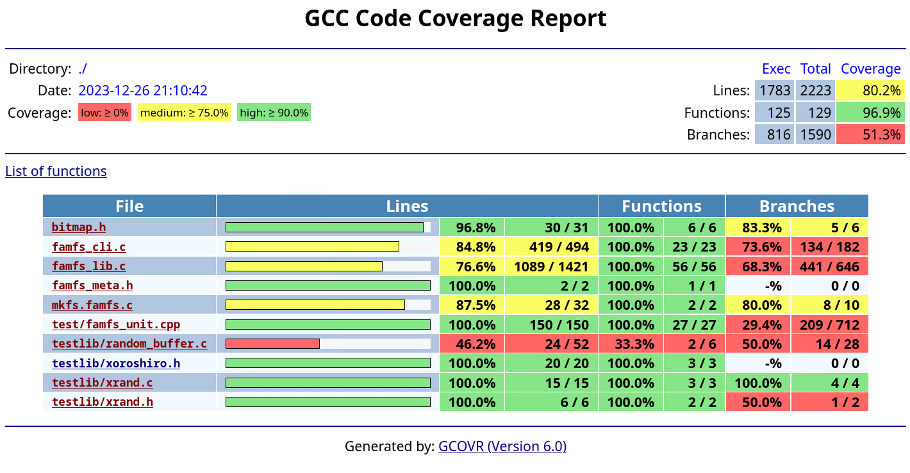

# Getting started with famfs

# Quick Links
- [Famfs CLI Reference](markdown/famfs-cli-reference.md)
- [Buillding a famfs-compatible kernel](markdown/building-a-6.5-kernel.md)
- [Famfs Usage - Getting Started](markdown/famfs-usage.md)

# Preparing to build famfs
Famfs is comprised of a kernel module and a set of user space tools and libraries.
The whole thing can be built from the top directory of the repo, but there are a
few prerequisites that must be met.

* You must currentlly be running a Linux 6.5 kernel. See
  [Buillding a famfs-compatible kernel](markdown/building-a-6.5-kernel.md)
* You need the appropriate set of development tools. On fedora 39, the following are
  required
    - Group: "Development Tools"
    - Packages: kernel-devel, zlib, libuuid-devel, (what else?)
* The kernel source (or kernel-devel package for your stock kernel) is required in order
  to build the famfs kernel module.
  If you are running a stock distro kernel, it is probably not Linux 6.5. So you
  probably need to build and install the kernel linked above. If you have installed that
  and are running it, the prereqs for building the famfs kernel module should be met.

# Building famfs

From the top level directory:

    make clean all

This command also works in the ```kmod``` and ```user``` directories, and just builds the kmod
or user code respectively

# Preparing to run famfs

In order to run famfs you need either a pmem device (e.g. /dev/pmem0) or a
devdax device (e.g. /dev/dax0.0). To run in a shared mode, you need more than one
system that shares a memory device.

As of late 2023, a pmem device is recommended, as the devdax support requires an
experimental kernel patch.

## Configuring a non-shared simulated pmem device

If you just want to build famfs and run basic tests, this is the easiest thing to do.

The easiest way to configure a pmem device is to edit your /etc/default/grub file and
add the following to the GRUB_CMDLINE string:

    memmap=8G!24G

This will reserve 8G of memory at offset 24G into system physical RAM as a simulated
pmem device. You must check your available memory and make sure that you have enough to
back the entire range - if not, it won't work well...

AFter doing that, you willl need too run the following command (assuming your system
is in efi mode:

    sudo grub2-mkconfig -o /boot/efi/EFI/fedora/grub.cfg
    sudo reboot

After a reboot, you should see a pmem device.

## Configuring a set of VMs to share a simulated pmem device

    Jacob to fill in !!

# Running tests
Famfs already has a substantial set of tests, though we plan to expand them substantially
(and we would love your help with that!).

## Running smoke tests

The famfs smoke tests load the kernel module, create and mount a famfs file system, and
test its funcionality.
The smoke tests can be run by a non-privileged user if the user has password-less sudo
enabled. Otherwise you must run them as root.

If you have already successfully built famfs and configured a pmem device, you can run smoke tests
as follows:

    cd user
    ./run_smoke.sh

You can see an example of the [full output from run_smoke.sh here](markdown/smoke-example.md)

The smoke tests (by default) require the following:

* A valid /dev/pmem0 device which is at least 4GiB in size

## Running unit tests

Famfs uses the googletest framework for unit testing code components, although test coverage
is still limited.

    cd user/debug
    sudo ctest

Or you can do this:

    cd user
    sudo make test

You can also do this:

    cd user
    sudo debug/test/famfs_unit_tests

Important note: the unit tests must be run as root or under sudo, primarily because
getting the system UUID only works as root. We may look into circumventing this...

## Code Coverage

To build for coverage tests, do the following in user:

```
make clean coverage
[sudo] ./run_smoke.sh
cd debug; sudo make famfs_unit_coverage
```
The resulting report looks like this as of the last week of December 2023.


This is the combined coverage from smoke and unit tests.